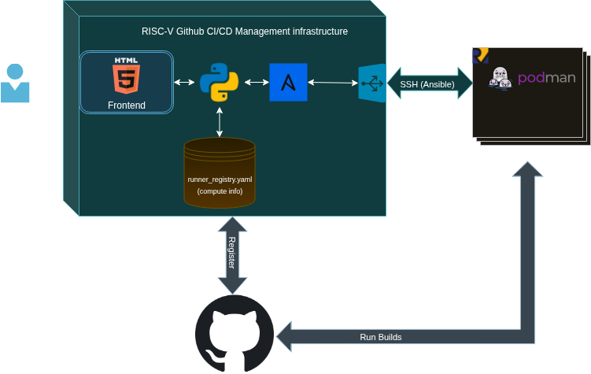

# Managing RISC-V compute machines as GitHub CI/CD runners

## What does this setup do

This infrastructure is for managing RISC-V boards as the GitHub runners. This setup works almost out of the box to:

- Set up the RISC-V boards with the infrastructure
- Registering RISC-V board as CI/CD compute machines in the GitHub repositories
- Unregistering the boards as runners
- Removing the boards from this infrastructure




## Getting Started

### Pre-requisites

- The RISC-V boards which are to be added to this infrastructure have to be accessible through SSH private key with `root` (for installing packages and installing gitlab runner as systemd service) user and a new user called `github-runner-user`
- The `github-runner-user` should be added as a non-sudo user in the board
- `python3` should be installed on the board as well as on the machine running this flow as a system-wide package
- `pip` should be installed on the compute machine running this flow

```
sudo apt install python3 python3-pip
```

### Starting the webflow

Web flow can be started by executing the following commands.

```
git clone https://github.com/alitariq4589/github-actions-riscv.git
cd github-actions-riscv
pip install -r requirements.txt
./start.py
```

After running this command, the web UI can be accessible through web browser at `localhost:5000`.

### How do the jobs run inside RISC-V boards

If you want to understand how the GitHub CI builds will run inside the RISC-V boards, take a look at [this link](https://10x-engineers.github.io/riscv-ci-partners/setting_up_github_runner/#:~:text=Cloud%E2%80%91V.-,How%20the%20GitHub%20Action%20workflow%20works,-The%20flow%20uses) explaining how this infrastructure sets up podman inside the RISC-V board.

## Contributing

We welcome any contribution to this flow. If you find any issues, feel free to create an issue.

Need to add a new feature? Create a Pull request.

Be sure to read the complete [documentation of this infrastructure](/docs/).